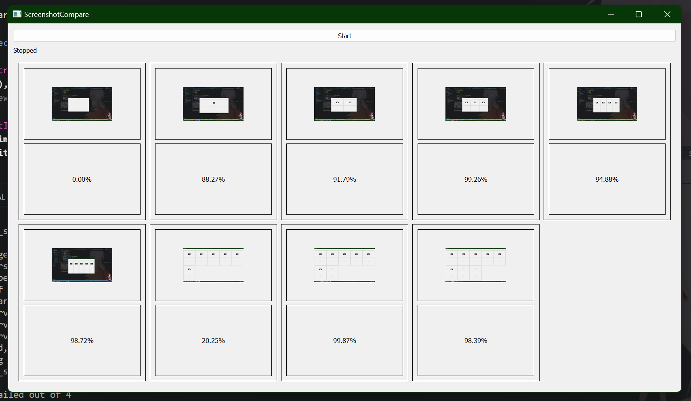
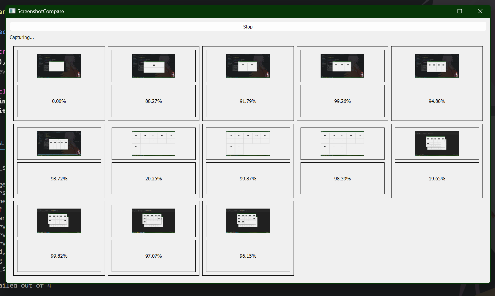
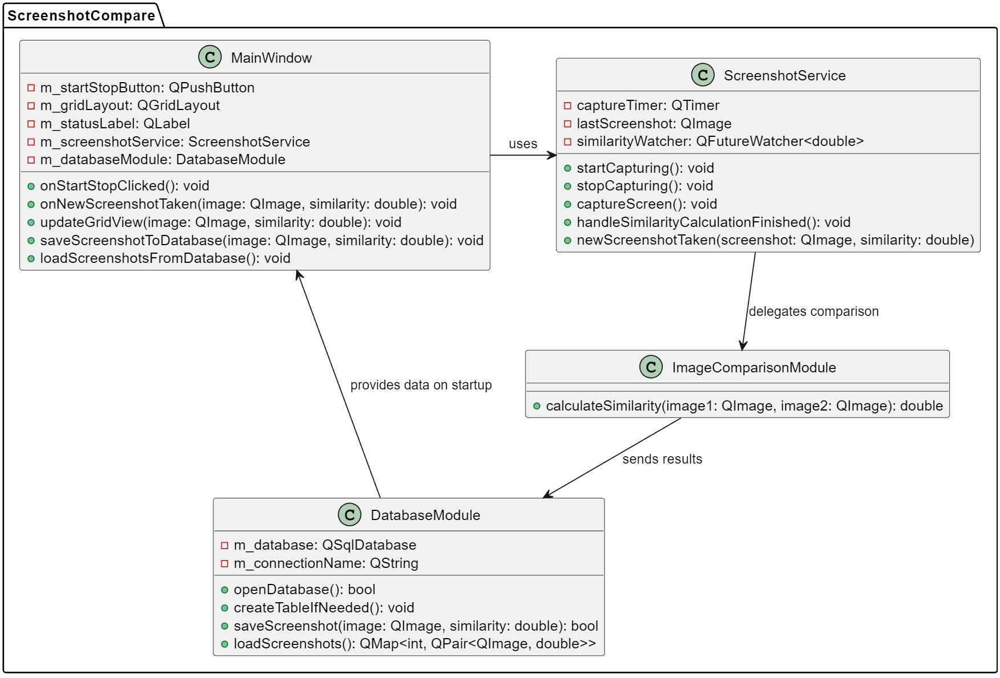

# ScreenshotCompare

ScreenshotCompare is a Qt-based application designed to capture and compare screenshots over time. This tool is particularly useful for visual regression testing and monitoring changes in display environments.

## Features

- Automated screenshot capture at regular intervals.
- Comparison of screenshots with a calculated similarity score.
- Storage and retrieval of screenshot data from a local database.

## Installation

To set up ScreenshotCompare on your system, follow these instructions:

### Prerequisites

Ensure you have the following installed:

- Qt5
- CMake (3.5+)
- A C++ compiler (GCC for Linux, MinGW for Windows)
- Git

**Important**: Verify that the paths to Qt, CMake, and your compiler are added to your system's PATH environment variable.

### Clone the Repository

Clone ScreenshotCompare to your local machine:

```bash
git clone https://github.com/Sage-Cat/ScreenshotCompare.git
cd ScreenshotCompare
```

### Build Instructions

Navigate to the project directory and run the following commands:

```bash
mkdir build
cd build
cmake .. -G "MinGW Makefiles" # Use "Unix Makefiles" for Unix-based systems
cmake --build .
```

### Running the Application

After building, run the `ScreenshotCompare` executable from the `build/bin` directory.

### Running tests

Tests could be run using `ctest` inside the build directory:

```bash
ctest --verbose
```

## Documentation

### Run demonstration

It's enough just to click on Start button and it will start the process of screenshoting and comparing



To stop the process you could just click "Stop" button



### Application design

Here is the application architecture



### Configuration

Default time interval for screenshoting is 1 minute. You can edit this in [screenshot_service.cpp](https://github.com/Sage-Cat/ScreenshotCompare/blob/main/src/screenshot_service.cpp)

```cpp
const std::chrono::seconds ScreenshotService::DEFAULT_TIME_INTERVAL{60};
```

## License

This project is open-sourced under the MIT License. See [LICENSE.md](LICENSE) for more information.

## Acknowledgments

- A shoutout to all contributors and the Qt community.
- Inspired by the need for efficient visual regression testing tools.
